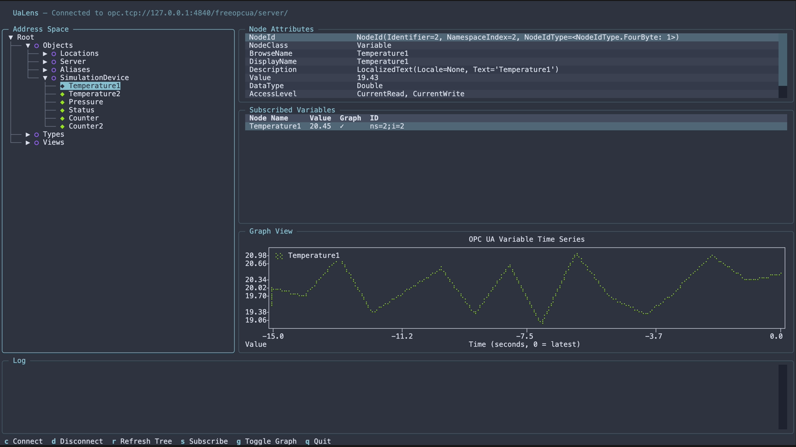

# ualens

A keyboard-driven OPC UA explorer for the terminal, built with [Textual](https://textual.textualize.io/).



OPC UA explorers like UaExpert and Prosys are great, but they require a graphical environment. `ualens` fills the gap: browse address spaces, inspect node attributes, and monitor live variable data — entirely from your terminal.

## Features

- **Connection Management** — Connect to any OPC UA server over TCP, with optional username/password authentication. Save servers as Favorites for quick reconnects.
- **Address Space Tree** — Navigate the full address space with lazy loading, so large servers stay fast.
- **Node Attributes** — Select any node to instantly inspect its NodeId, BrowseName, Value, DataType, AccessLevel, and more.
- **Live Monitoring** — Subscribe to Variable nodes and watch values update in real time.
- **Graphing** — Plot any subscribed variable as a time-series chart directly in the terminal.
- **Integrated Log** — Connection events and errors appear in a live log pane.

## Installation

```bash
# pip
pip install "ualens @ git+https://github.com/tobijkl/ualens.git"

# uv
uv tool install "ualens @ git+https://github.com/tobijkl/ualens.git"
```

## Usage

```bash
ualens
```

Connect directly on startup (skips the dialog):

```bash
ualens --url opc.tcp://hostname:4840/path/
ualens --url opc.tcp://hostname:4840/path/ --username user --password secret
```

### Key Bindings

| Key | Action |
|-----|--------|
| `c` | Open connection dialog |
| `d` | Disconnect |
| `r` | Refresh address space tree |
| `s` | Subscribe / unsubscribe selected variable |
| `g` | Toggle graph for selected row in the table |
| `Tab` | Cycle focus between panels |
| `↑ ↓` | Navigate tree / table |
| `Enter` / `Space` | Expand / collapse tree node |
| `q` / `Ctrl+C` | Quit |

Inside the connection dialog: `Enter` to connect, `Esc` to cancel.

## Development

Clone and set up the environment with [uv](https://docs.astral.sh/uv/):

```bash
git clone https://github.com/ualens/ualens.git
cd ualens
uv sync --group dev
```

Start the bundled mock OPC UA server (also available as `ualens-mock-server` after install):

```bash
uv run ualens-mock-server
# with authentication:
uv run ualens-mock-server --username user --password secret
```

The mock server exposes `opc.tcp://127.0.0.1:4840/freeopcua/server/` with a `SimulationDevice` object containing `Temperature1`, `Temperature2`, `Pressure`, `Status`, `Counter`, and `Counter2` — all updated every second.

Run tests:

```bash
uv run pytest          # all tests
uv run pytest tests/test_app.py::test_app_initial_state  # single test
```

## Known Limitations

- Layout on very small terminals (< 30 rows) is constrained by minimum widget heights.
- The graph legend shows variable names in the plotext label format; no separate legend box is rendered (plotext limitation).

## License

[MIT](LICENSE)
